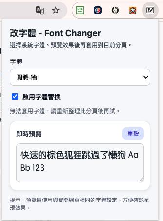

# Font Changer Chrome Extension

Oli Font Changer 是一個用來替換網頁字體的 Chrome/Brave 擴充套件，讓你可以用自己系統裡已安裝的字體閱讀網站內容。

## 功能

- 從系統可用字體中挑選要套用的字體
- 啟用或停用目前分頁的字體替換
- 針對目前網站設定「不生效」，並記錄在該網站的 `localStorage`
- 在 popup 內即時預覽字體效果
- 將設定儲存在 `chrome.storage.sync`
- 支援一般頁面與多數 iframe 內容

## 版本

目前版本：`1.6.0`

本次版本修正：

- 改用 `chrome.fontSettings.getFontList()` 的 `displayName` 當作 CSS `font-family`
- 保留舊版 `fontId` 設定的相容讀取，避免升級後遺失原設定
- 擴大字體覆蓋範圍到 `html`、表單元素與 frame
- 補上 `CHANGELOG.md`
- 對已開啟但尚未載入 content script 的分頁補做動態注入，減少「要先手動重新整理才有用」的情況
- 對 open shadow DOM 與動態插入內容同步補上字體樣式，提升元件化網站的覆蓋率
- 新增「此網站不生效」開關，使用網站自己的 `localStorage` 記住站點排除設定

## 為什麼之前可能會失效

先前版本直接把 `fontId` 當成 CSS 字體名稱使用。`fontId` 是 Chrome 擴充 API 的識別值，不保證等於網頁 CSS 可直接套用的字體 family name，因此在部分字體或瀏覽器版本下，可能看起來像是「突然改不了字體」。

另外，以下頁面本來就可能無法被擴充套件修改，或只能部分修改：

- `chrome://`、`brave://` 等瀏覽器內建頁面
- Chrome Web Store 或其他受限制頁面
- 使用 closed shadow DOM、canvas、SVG path 或圖片輸出的文字內容

## 安裝

1. 下載或 clone 這個專案。
2. 打開 `chrome://extensions/` 或 `brave://extensions/`。
3. 開啟右上角的「開發者模式」。
4. 點擊「載入未封裝項目」。
5. 選擇這個專案資料夾。
6. 如果已經載入過舊版，請按一次重新整理按鈕，確保 `manifest.json` 的版本更新生效。

## 使用方法

1. 打開你要閱讀的網站頁面。
2. 點擊工具列中的 Font Changer 圖示。
3. 從下拉選單選擇字體。
4. 開啟「啟用字體替換」。
5. 如果目前分頁沒有立即更新，重新整理一次該分頁再試。

## 技術細節

- 使用 Chrome Extension Manifest V3
- 透過 `chrome.fontSettings` 讀取系統字體清單
- 透過 content script 將樣式注入目前頁面
- 使用 `chrome.storage.sync` 保存選擇的字體與啟用狀態
- 使用網站本身的 `localStorage` 保存每個網站是否停用字體替換
- content script 已設定 `all_frames`、`match_about_blank`、`match_origin_as_fallback`

## 檔案結構

- `manifest.json`: 擴充套件設定
- `popup.html`: popup 介面
- `popup.js`: popup 邏輯與字體選擇
- `content.js`: 頁面字體注入邏輯
- `CHANGELOG.md`: 版本異動紀錄
- `images/`: 圖示

## 開發與驗證

每次修改後，建議至少檢查：

- 重新載入 unpacked extension
- 在 Chrome 與 Brave 各測一個一般網站
- 測試一個含有 iframe 的頁面
- 切換不同字體後確認 popup 預覽與實際頁面一致

本次已完成的基本檢查：

- `node --check popup.js`
- `node --check content.js`
- `node --test content.test.js`

## 貢獻

歡迎提出 issue 或 pull request。

## 許可證

本專案採用 MIT License。
